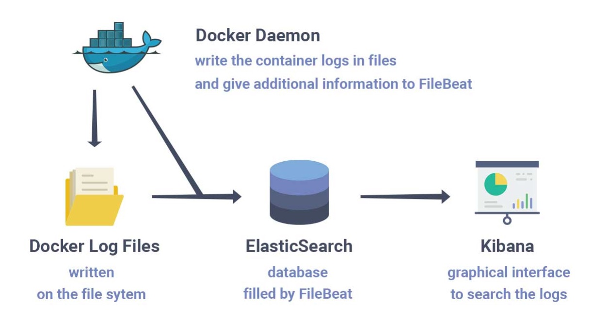

# Bond Registry Service

This is a reference implementation of a simple registry service that allows for
the creation, retrieval, update and deletion of *bonds*. A bond represents a
relationship between two parties (*accounts*) whereby one party (the subscriber
account) promises to pay the other (the host account) for services provided by
the host. It is shorthand for a 'charge-back relationship'.

The finished project will be a Python API (built on FastAPI) running in a
Docker container that speaks to Dynamodb as the back end. Note that all architectural choices are based on what I feel like learning that day and not guided by any design thinking or best practices beyond common sense.

## The Data Model
The natural key for a bond is a composite of host account id and subscriber
account id.

A *cost center* represents a funding entity and is used to group accounts.
There is a one-to-many relationship between cost centers and accounts. Host and
subscriber accounts may belong to the same cost center.

Each bond maintains a collection of *subscribers*. These are individuals who
are affiliated with the subscriber account and are authorized, based on the
bond, to request services from the host account.

An example bond record looks something like this:

```json
{
  "bond_id": "ID007",
  "host_account_id": "QYSS37952707405491",
  "sub_account_id": "SQSY48031267772693",
  "host_cost_center": "teal",
  "sub_cost_center": "yellow",
  "subscribers": {
    "rharper": {
      "sid": "rharper",
      "name": "Richard Harper",
      "email": "richharper@gmail.com"
    },
    "rlarson": {
      "sid": "rlarson",
      "name": "Rachel Larson",
      "email": "r.larson@gmail.com"
    },
    "kathill": {
      "sid": "kathill",
      "name": "Kathryn Hill",
      "email": "khill04@yahoo.com"
    }
  }
}
```

## Pre-requisites
```
Make
Docker and Docker Compose
AWS CLI
```

## Development Environment
Create a Python virtual environment on your local machine. For example, if you
are using venv, run the following from the top-level project directory:

To create the environment: ```python3 -m venv .venv```

To activate it: ```source .venv/bin/activate```

To deactivate it: ```deactivate```

To install the packages needed, run: ```pip install -r requirements.txt```

The source code for the application is in the ```registry``` directory.

### (Optional) Running the Registry in Pycharm


## Testing

*Note: Make sure the virtual environment is activated.*

### Linting
To test PEP8 compliance, run:
```shell script
pycodestyle --show-source --show-pep8 registry/ tests/
```

### Unit Tests

To run unit tests execute: ```python -m pytest tests/unit/test_*```

### Integration Tests

We use the ```testcontainers``` package to launch docker containers for the registry service and dynamodb
back end that make up the test environment. It takes a few seconds to launch and testing pauses until the environment
is ready. Once the tests have run to completion, the containers are shut down.

*Make sure Docker is running on your machine before you run the tests or they will fail.*

To run integration tests execute: ```python -m pytest tests/integration/test_*```


## Running It All Locally
The application can be run locally using containers for the various components. As
well as the Bond Registry application container itself, we launch a containers
for a local DynamoDB instance and an ELK stack (Elasticsearch, Kibana and Filebeat).

### Launching Containers
I bring up the containers via a Makefile with `make init`.

Which should give us:
```
$ docker-compose ps
Name                   Command               State                       Ports
--------------------------------------------------------------------------------------------------------
bond-registry    /start.sh                        Up      80/tcp, 0.0.0.0:5000->8080/tcp
dynamodb-local   java -jar DynamoDBLocal.ja ...   Up      0.0.0.0:8000->8000/tcp
elasticsearch    /tini -- /usr/local/bin/do ...   Up      0.0.0.0:9200->9200/tcp, 0.0.0.0:9300->9300/tcp
filebeat         /usr/local/bin/docker-entr ...   Up
kibana           /usr/local/bin/dumb-init - ...   Up      0.0.0.0:5601->5601/tcp  

```

*Note: It may take up to a minute before all the container services (e.g. Kibana) are fully up and accepting requests. This is why the Make file has sleep and retry logic in it.*

Testing it via curl should give us: `curl -X GET "http://localhost:5000/bonds/FOO" -H "accept: application/json"`

```json
{
  "bond_id": "FOO",
  "host_account_id": "TAPV54703350425479",
  "sub_account_id": "IMII87361536320662",
  "host_cost_center": "olive",
  "sub_cost_center": "blue",
  "subscribers": {
    "aaronorr": {
      "sid": "aaronorr",
      "name": "Lori Rodriguez",
      "email": "mistymoore@yahoo.com"
    },
    "christopherwashington": {
      "sid": "christopherwashington",
      "name": "David Watkins",
      "email": "patrickbaker@hotmail.com"
    },
    "jessicadavis": {
      "sid": "jessicadavis",
      "name": "Emily Garrett",
      "email": "walter59@yahoo.com"
    }
  }
}
```

#### Shutting them Down
I bring it all down with `docker-compose down -v`.

### Localhost Ports and Handy Links

| What | Port | Link |
| :--- | :--- | :--- |
| Bond Registry Endpoint | 5000 | [OpenAPI Docs](!http://localhost:5000/docs) |
| (Local) DynamoDB | 8000 |  |
| Elasticsearch | 9200 | |
| Kibana | 5601 | [Bond Registry Logs](!http://localhost:5601/app/discover#/?_g=(filters:!(),refreshInterval:(pause:!t,value:0),time:(from:now-15m,to:now))&_a=(columns:!(json.asctime,json.message,json.level,json.levelname,json.loglevel),filters:!(('$state':(store:appState),meta:(alias:!n,disabled:!f,index:f47cf090-fc0b-11ea-9e26-b3288f1b7c93,key:container.image.name,negate:!f,params:(query:bond-registry_bond-registry),type:phrase),query:(match_phrase:(container.image.name:bond-registry_bond-registry)))),index:f47cf090-fc0b-11ea-9e26-b3288f1b7c93,interval:auto,query:(language:kuery,query:''),sort:!())) query |


### Local DynamoDB
The amazon/dynamodb-local image has been added to `docker-compose.yml`

In production, the DynamoDB table will have been created via Terraform, so
our code will expect a table to be there already. Locally, I will run a shell
script once the container has been brought up to create the table and populate
it with some test data.

The directory structure for all this looks like this:

```
localdb
    |-- 01-create-table.json
    |-- 02-load-data.json
    |-- init.sh
```
* `01-create-table.json` This file creates a table called 'bond' in DynamoDB.
* `02-load-data.json` This will load dummy data into DynamoDB.
* `init.sh` Runs some AWS CLI commands and uses the above files as input.


#### (Optional) Running Some Queries Against the Local DynamoDB Instance
Here are some queries to play with the local DynamoDB environment:

_(Note: The AWS_ACCESS_KEY_ID and AWS_SECRET_ACCESS_KEY env vars are set for
    every command. This is because I want to ensure my local global version
    of these env vars (which are pointed at my own private AWS account)
    are not used.)_

##### Describe the bond table
```
AWS_ACCESS_KEY_ID=AWS_ACCESS_KEY_ID \
AWS_SECRET_ACCESS_KEY=AWS_SECRET_ACCESS_KEY \
aws dynamodb describe-table \
    --table-name bond \
	--endpoint-url http://0.0.0.0:8000 --region us-west-2
```

##### Get me a specific record
```
AWS_ACCESS_KEY_ID=AWS_ACCESS_KEY_ID \
AWS_SECRET_ACCESS_KEY=AWS_SECRET_ACCESS_KEY \
aws dynamodb query \
    --table-name bond \
    --key-condition-expression "bond_id = :v1" \
    --expression-attribute-values "{ \":v1\" : { \"S\" : \"FOO\" } }" \
	--endpoint-url http://0.0.0.0:8000 --region us-west-2
```

##### List the entire contents of the table
```
AWS_ACCESS_KEY_ID=AWS_ACCESS_KEY_ID \
AWS_SECRET_ACCESS_KEY=AWS_SECRET_ACCESS_KEY \
aws dynamodb scan \
    --table-name bond \
	--endpoint-url http://0.0.0.0:8000 --region us-west-2
```


## Logging
The Bond Registry application logs are JSON encoded and streamed to `sysout` on the container. Docker writes these out as log files into directories on the Docker host, one directory for each container.

The Bond Registry container logs can be tailed with `docker logs --follow bond-registry`. However, Elastic stack (ELK) is deployed as part of the local deploy (with `make init`) so the logs can also be viewed in Kibana.

To deploy ELK on Docker, I based the Docker Compose and configuration files on https://github.com/deviantony/docker-elk.git. However, for this project I substitute the more light-weight Filebeat for Logstash.



Filebeat is used to tail the container logs and push them to elasticsearch. Filebeat creates an index, `filebeat-*` in Elasticsearch on start-up that Kibana is able to search.

### Configuration
Edit `.env` to set the ELK version:
```
ELK_VERSION=7.9.1
```

In a production deployment, Filebeat can be configured to write to multiple sinks, e.g. a hosted Elasticsearch environment. Edit `./kibana/config/kibana.yml` to change the output target. (The example below outputs to the local elasticsearch container.)
```
output.elasticsearch:
  hosts: ["elasticsearch:9200"]
```

### Validating Filebeat Configuration (Local)
```
% docker exec -it filebeat filebeat test config
Config OK
```

```
% docker exec -it filebeat filebeat test output
elasticsearch: http://elasticsearch:9200...
  parse url... OK
  connection...
    parse host... OK
    dns lookup... OK
    addresses: 172.30.0.2
    dial up... OK
  TLS... WARN secure connection disabled
  talk to server... OK
  version: 7.9.1
  ```

### Validating Elasticsearch Configuration (Local)
```
% curl -X GET 'localhost:9200/_cat/nodes?v&pretty'
ip         heap.percent ram.percent cpu load_1m load_5m load_15m node.role master name
172.30.0.2           53          95   7    0.08    0.14     0.19 dilmrt    *      91a349d1e8a5
```

```
% curl -X GET 'localhost:9200/_cat/indices?v&pretty'
health status index                            uuid                   pri rep docs.count docs.deleted store.size pri.store.size
yellow open   filebeat-7.9.1-2020.09.21        IFdGlQdqSE64K4urz5hJoA   1   1        365            0    630.3kb        630.3kb
...
```
